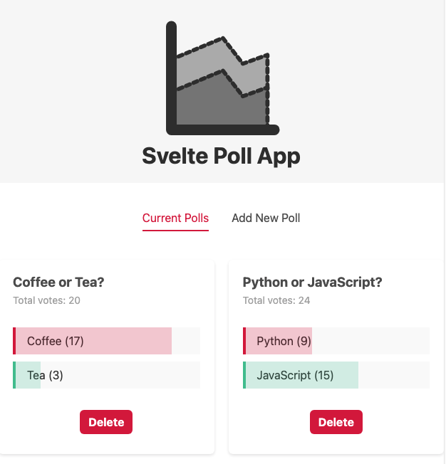

# Svelte Poll Demo App

This is an app I completed from Shaun Pelling's "Svelte Tutorial for Beginners". It's a cool little app that covers lots of Svelte's functionality. If you are new to Svelte I highly recommend it. Check out his YouTube channel: The Net Ninja.

## Wanna see this in action?

Check the app live here: <a href="https://svelte-poll-app.vercel.app/">https://svelte-poll-app.vercel.app/</a>

## Prefer to try locally?

If you want to try locally, just follow Svelte's documentation to make sure you install everything you need, clone this to your local environment, run `npm install`, `npm run dev` and navigate to `http://localhost:5000`.
